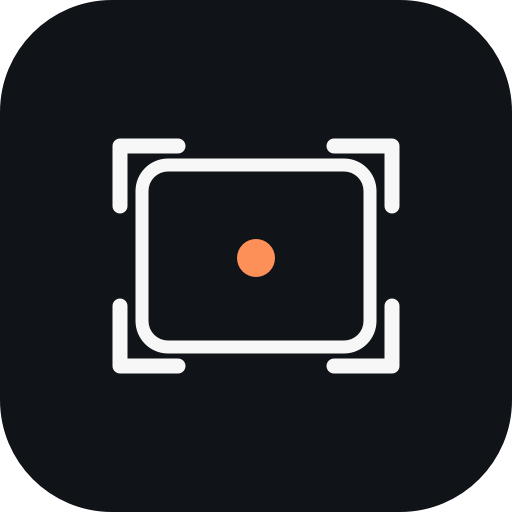

<p align="center">
  
</p>

<h1 align="center">Framewise</h1>

<p align="center"><strong>Compose the shot you have in mind.</strong><br>
An on-device camera guide that helps you find your subject, refine the frame, and take the shot.</p>

<p align="center">
  <a href="https://github.com/hesm4tt/framewise-ipa/releases/latest"></a>
  
  
</p>

<p align="center">
  <a href="https://docs.sidestore.io/docs/advanced/app-sources"><strong>Install with SideStore</strong></a>
  &nbsp; · &nbsp;
  <a href="https://github.com/hesm4tt/framewise-ipa/releases/latest/download/Framewise.ipa"><strong>Download the latest IPA</strong></a>
</p>

## A little more intention in every frame

Framewise gives you a live subject guide, clear move-the-phone cues, and an easy suggested zoom. Tap the subject you want and Framewise keeps its guide with that choice as you reframe.

- Live subject detection and tracking, with tap-to-select.
- Simple movement guidance and one-tap suggested zoom.
- 0.5×, 1×, 2×, 4×, and 8× zoom controls when the camera supports them.
- High-quality camera capture, local film looks, and a private in-app gallery.
- On-device Core ML and Apple Vision processing. No AI API key, account, or per-shot charge.

## Install with the method you already use

Framewise is a standard iOS IPA, not a LiveContainer-only app. Use any trusted installer that accepts a standard IPA and supports your iOS version and signing setup. The current build requires iOS 15 or later.

### SideStore

SideStore is the quickest route if you already use it. First, open the [SideStore app-source guide](https://docs.sidestore.io/docs/advanced/app-sources), then add this source URL in SideStore:

```text
https://github.com/hesm4tt/framewise-ipa/releases/latest/download/framewise.json
```

The source follows the latest release, so you can install and update Framewise from SideStore.

### Other sideloading options

| Method | Get started | Install Framewise |
| --- | --- | --- |
| **SideInstaller** | [Official setup](https://sideinstaller.net/) · [official repo](https://github.com/FrizzleM/SideInstaller) | SideInstaller can set up SideStore or LiveContainer on supported devices. Then add the Framewise SideStore source above or import the IPA. Check the current iOS and pairing requirements first. |
| **AltStore Classic** | [AltStore](https://altstore.io/) · [official guide](https://faq.altstore.io/) | Download the IPA below and import it in AltStore Classic. The SideStore source link above is for SideStore. |
| **Sideloadly** | [Official download and guide](https://sideloadly.io/) | Download the IPA below and install it from Sideloadly on macOS or Windows. |
| **Feather** | [Official project and releases](https://github.com/iProdb/Feather) | Import the IPA below and use your own compatible signing setup. |
| **LiveContainer** | [Official project and install guide](https://github.com/LiveContainer/LiveContainer) | LiveContainer is optional. After setting it up with a supported installer, open LiveContainer, tap **+**, and import the Framewise IPA. |

> **LiveContainer note:** its installation guide lists Sideloadly as unsupported for installing LiveContainer itself. That does not make Framewise LiveContainer-only; install Framewise directly with Sideloadly, or set up LiveContainer using its [supported installation guide](https://livecontainer.github.io/docs/installation/).
>
> **SideInstaller note:** SideInstaller is an independent project, not affiliated with SideStore. Use only [sideinstaller.net](https://sideinstaller.net/) or its [official GitHub repository](https://github.com/FrizzleM/SideInstaller), and review its current device requirements.

### Direct IPA

[Download Framewise.ipa](https://github.com/hesm4tt/framewise-ipa/releases/latest/download/Framewise.ipa) and import it with your preferred IPA installer. You can also browse the [release history](https://github.com/hesm4tt/framewise-ipa/releases).

## Privacy and cost

Framewise runs its camera analysis, composition guidance, and photo treatments on your device. It has no cloud AI service or API billing. Photos remain in Framewise’s private app library unless you choose to share them.

## About

Framewise is an independent project. It is not affiliated with Apple, Framed, SideStore, SideInstaller, AltStore, Sideloadly, Feather, or LiveContainer.
