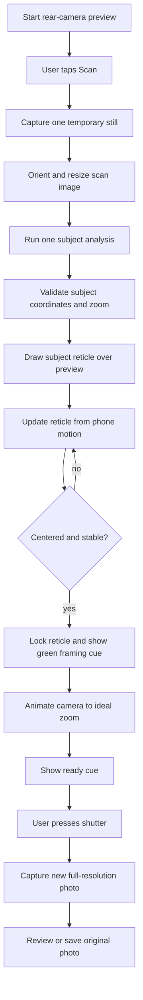

# AI Camera Scan, Motion Guide, Zoom, and Capture

Implementation handoff for building a one-shot camera-analysis flow in another app. It records the behavior recovered from the Framed iOS bundle and maps that behavior to the native Swift architecture already used by Framewise.

## What to build

Capture one temporary camera still, analyze it once, show the selected subject as a guide over the live preview, and use phone motion to keep the guide anchored to the scene while the user re-aims. When the guide is centered and stable, lock it, move to the suggested camera zoom, show a ready cue, and let the user press the shutter. The final photo is a new full-resolution camera capture. **Do not crop the final photo to simulate this flow.**

Do not send every preview frame to an AI service. Do not copy credentials, private endpoints, or app-specific keys from the reference bundle. Use a local model or your own authenticated service.

## End-to-end flow



## Reference behavior recovered from Framed

### One-shot scan

The reference captures a temporary still through its camera API, normalizes orientation, resizes it to roughly 768 pixels, JPEG-compresses it, and sends its Base64 data URL with a photography prompt to a remote vision proxy. It does not stream the preview to the model. The scan result includes a subject point (`subjectX`, `subjectY`), a subject label, `idealZoom`, optional brightness/angle guidance, and short text.

The point uses normalized image coordinates: top-left is `(0, 0)`, bottom-right is `(1, 1)`. It identifies where the chosen subject is in the scan image. It is not a crop rectangle or a desired final-photo coordinate. The reference does not request a bounding box and no final-photo crop call was found in this flow.

The bundle contains a remote proxy request path, so the reference scan is not purely on-device. The proxy implementation was not in the supplied app archive. A port should use its own service and credentials, or use a local model; never reuse an embedded app key.

### Guide placement and motion tracking

The reference places a reticle at the scan result's normalized point. Its post-scan tracker uses gyroscope samples; the inspected path does not run a new visual detector on each preview frame. The tracked point starts at `(subjectX, subjectY)`, and phone rotation updates the point relative to the screen center.

Recovered tracker settings and behavior:

- Requested sensor update interval: **32 ms**.
- Ignore a sample when elapsed time is nonpositive or exceeds **200 ms**.
- Integrate angular velocity into normalized screen position, scaled by `max(1, zoomFactor)`. The decompiled update is approximately:

  ```text
  trackedX += gyroY * dt * max(1, zoomFactor) / 1.2
  trackedY += gyroX * dt * max(1, zoomFactor) / 1.6
  ```

- Direction hints use an easy-to-read band: `x < 0.4` means left, `x > 0.6` means right, `y < 0.4` means up, and `y > 0.6` means down. Inside that band, the copy says the subject is centered.
- That copy is not the lock condition. The lock condition is a radial test around exact center: `hypot(trackedX - 0.5, trackedY - 0.5) < 0.06` continuously for **more than 600 ms**. Leaving the radius resets the dwell timer.
- On success, the tracker latches so the callback fires once, snaps the guide point to screen center, and calls the screen's `onCentered` handler.

The reference's `SubjectReticle` derives its frame size from the requested zoom relative to scan/base zoom. Its unlocked accent is yellow (`#FFD60A`); the locked state is green (`#30D158`). The camera screen moves from `tracking` to `zooming` only after the centering callback. It logs/haptics, starts the zoom about **100 ms** later, animates for about **600 ms**, and enters `ready` about **900 ms** after the callback. The green framing message and reticle persist through zooming and ready. Locking does not take the final photo; the user presses the shutter.

A separate accelerometer-based stillness hook is active during the reference's `scanning` phase. It is not the post-scan guide lock test.

## Recommended implementation structure

Keep camera capture, analysis, tracking, zoom, and UI state separate. A useful conceptual state machine is:

| State | Work | Exit condition |
|---|---|---|
| `preview` | Live camera preview and manual controls | User starts scan |
| `scanning` | Capture one temporary still and run analysis | Valid result or recoverable error |
| `tracking` | Draw subject guide and update it from motion | Centered dwell succeeds, user retargets, or cancels |
| `zooming` | Lock guide and animate to the recommended zoom | Zoom animation completes |
| `ready` | Show green/ready cue; wait for user | User presses shutter or changes framing |
| `capturing` | Capture a new full-resolution still | Capture succeeds or fails |
| `review` | Display captured original and next actions | Return to preview or save/share |

Use a generation ID or cancellation token for each scan and zoom animation. Ignore late model/camera callbacks after the user cancels or starts a newer scan. Keep sensor/camera callbacks off the UI thread where the platform requires it, and publish UI state on the main thread.

### Scan image and model contract

1. Confirm camera permission and a running capture session.
2. Capture one temporary still at a speed-oriented setting.
3. Correct orientation before interpreting coordinates. Resize the scan image to a maximum dimension near **768 px**, JPEG-compress around **0.53**, and discard the temporary file when analysis finishes.
4. Run one inference. Validate all model values for finiteness, expected coordinate origin, image bounds, and supported zoom range.
5. Preserve a clear distinction between the temporary scan image and the final shutter photo.

For an implementation that needs a visible subject frame and reliable zoom calculation, prefer a normalized bounding box:

```json
{
  "label": "red coffee cup",
  "x": 0.31,
  "y": 0.24,
  "width": 0.28,
  "height": 0.39,
  "confidence": 0.91,
  "framing_tip": "Move closer and leave room above it"
}
```

State the origin in the model prompt and normalize at the API boundary. Vision/Core Graphics boxes commonly use a bottom-left origin; many model prompts return top-left coordinates. For a top-left model box, convert to bottom-left as `yVision = 1 - yTop - height`. Do not mix point coordinates, boxes, preview coordinates, and sensor focus points in one unnamed `CGPoint`.

If the user taps the preview to select a subject, convert the tap through the preview's aspect-fill crop before making it normalized image coordinates. Keep the camera focus coordinate conversion separate from the model-selection coordinate conversion.

### Motion guide and lock

For exact Framed parity, use the recovered gyro integrator above rather than a scan-time attitude/FOV projection. Start the point at the scan result, integrate portrait gyroscope samples at about 32 ms, reject invalid intervals, and scale movement by zoom relative to the scan. Clamp or fade targets that move off-screen. Do not claim the guide visually follows a moving object unless continuous visual tracking is actually implemented. An attitude/FOV projection can be a native adaptation, but do not combine it with the reference integrator.

If reproducing Framed's observed lock behavior, implement the recovered gyro integration and dwell test above. Sensor signs vary with portrait orientation and camera axis; calibrate signs on device and verify that moving the phone toward the indicated direction moves the marker toward center. Avoid treating a single centered sample as a lock.

If implementing a box-based guide, define readiness explicitly. A practical gate is all of:

```text
subject center within the chosen center tolerance
AND camera zoom is settled at the chosen target
AND any required horizon/exposure/composition checks pass
AND optional centered dwell has elapsed
```

The ready cue should be driven by that one readiness property, not by a different ad hoc threshold in the overlay, status label, and shutter.

### Zoom selection

Treat `idealZoom` as an absolute display magnification, not an increment to add to current zoom. Discover the camera's supported physical lenses and native zoom limits at runtime. Convert display zoom to native zoom, clamp to supported values, apply through the platform camera API, and cancel an outdated animation if the target changes.

The Framed bundle has these approximate calibration anchors: `0.5x` ultra-wide at native digital zoom `0`; `1x` wide at `0`; `2x` wide at `0.12`; `3x` wide at `0.22`; `5x` wide fallback at `0.45`. It prefers ultra-wide at/below roughly `0.7x`, telephoto at/above roughly `4x`, and wide otherwise. Interpolate between points only as a device-specific calibration. Do not hard-code this table as universal hardware behavior.

For a bounding-box implementation, a useful target-width rule is:

```text
targetZoom = scanZoom * desiredNormalizedSubjectWidth / max(subjectBox.width, minimumWidth)
```

Clamp to valid device stops. If a physical lens stop is close enough, prefer it; otherwise use a supported intermediate zoom. Show the zoom recommendation before automatically applying it if that better suits the target app's interaction design.

### Ready state and final capture

On the lock/readiness transition:

1. Latch the target and give one success haptic.
2. Change the guide to its green locked state and show a short framing/ready message.
3. Animate to the ideal zoom. Do not let an old animation report completion after a newer target or user zoom change.
4. Mark ready only after centering and zoom requirements are satisfied. If motion leaves the accepted region, remove the ready cue and relock/re-evaluate.
5. Wait for an explicit shutter press; do not capture automatically merely because the tracker locked.

Capture a separate photo at the active camera zoom using the highest dimensions/quality the device and app support. The scan JPEG is only model input. Preserve the original photo; apply optional looks, export compression, or an optional crop as separate operations. The inspected Framed path changes physical/digital camera zoom and does not crop the final photo.

## Mapping to the current Framewise Swift project

The current project implements the same user flow with native camera, scan, and display components. Inspect these files before adding a second scanner or tracker:

- [CameraEngine.swift](../Framewise/CameraEngine.swift) — AVFoundation session, temporary scan capture, one-shot analysis dispatch, motion baseline/projection, zoom, framing readiness, and final still/optional RAW capture.
- [OpenRouterAI.swift](../Framewise/OpenRouterAI.swift) — opt-in OpenRouter request, normalized top-left box parsing, validation, and conversion into Vision/Core Graphics bottom-left coordinates.
- [CameraView.swift](../Framewise/CameraView.swift) — subject overlay, movement/readiness UI, camera controls, shutter action, and aspect-fill tap-coordinate conversion.
- [README.md](../README.md) — product-level privacy and feature summary.

Important differences from the Framed reference:

| Behavior | Framed reference | Current Framewise project |
|---|---|---|
| Analysis | Remote vision proxy observed in bundle | On-device Core ML/Vision by default; optional user-configured OpenRouter with local fallback |
| Model output | Normalized subject point plus ideal zoom | Normalized subject box, label, confidence, and framing tip; its center supplies the guide point and its dimensions inform zoom/reticle size |
| Motion | Gyroscope integration at requested 32 ms interval | Core Motion device-motion samples at 32 ms; gyro Y updates top-left point X and gyro X updates point Y, scaled by zoom relative to scan |
| Lock | Point within 0.06 radial radius for >600 ms; latch and snap to center | Same radial 0.06 test and >600 ms dwell; latch, snap to center, delay zoom 100 ms, and enter ready at about 900 ms |
| Zoom | App-specific lens mapping curve | Runtime discovery of available lens stops and sensor dimensions |
| Capture | New camera still; no final crop | New full-resolution processed still, optional RAW sidecar; no final crop |

In Framewise, the relevant methods are `requestScan(at:)`, `finishScan`, `updateGyroscopeAnchoredTarget`, `updateCenteringDwell`, `latchCenteredSubject`, `startIdealZoom`, `isGoodComposition`, `setFramingReady`, and `capture`. The UI shutter readiness styling is driven by `camera.isFramingReady`; the green guide state is driven by `camera.isSubjectLocked`. Keep those states distinct: lock follows the Framed dwell callback, while shutter readiness waits for the zoom transition and composition checks. Framewise derives a point from its local/cloud bounding box and retains its fixed on-screen frame target, adaptive hardware zooms, and native exposure/horizon prompts.

## Failure handling and privacy

- Disable duplicate scans while a scan is pending. On failure, clear pending state and keep the user able to retarget or retry.
- If remote analysis is optional, fall back to the local model and label the active mode accurately.
- Never log image bytes, Base64 data, API keys, or raw model prompts/responses. Keep credentials in the platform's secure store and send cloud requests only with explicit user configuration/consent.
- If motion sensors are unavailable, retain a static target and explain that automatic motion framing is unavailable; do not falsely signal a completed lock.
- Clean up temporary scan files, sensor subscriptions, capture delegates, and stale timers on cancel, camera stop, or view dismissal.
- Keep full-resolution photos local unless the user explicitly chooses a share/export action.

## Acceptance checklist

- [ ] One scan creates one temporary still and one analysis request/inference; no preview-frame AI loop.
- [ ] Scan-image orientation and coordinate origin are consistent across local model, cloud model, overlay, and tap-to-retarget.
- [ ] A reticle begins at the selected subject and moves with phone re-aiming while the intended frame target stays fixed.
- [ ] Direction hints and lock use documented, consistent coordinate conventions.
- [ ] Lock requires the chosen center tolerance and, if used, the full dwell interval; leaving tolerance resets readiness.
- [ ] Green styling, ready text, and shutter readiness all follow the same state/property.
- [ ] Ideal zoom respects actual device limits and cancels stale animations.
- [ ] The final image is a separate high-quality shutter capture at the active camera setting.
- [ ] No accidental crop is applied to the final photo; scan resize is clearly limited to model input.
- [ ] Errors, cancellation, and unavailable sensors return the UI to a recoverable state.

## Handoff prompt for an implementation LLM

Read this guide and inspect the target app's existing camera/session, scan, sensor, zoom, preview-overlay, and shutter code before editing. Implement the scan → motion-guided framing → readiness → user-triggered full-resolution capture flow using the target app's architecture. Reuse existing components and state where possible; do not duplicate camera sessions or analysis paths. Keep the scan image separate from the final photo, do not crop the final image unless explicitly required, validate coordinate conventions, handle cancellation/stale callbacks, and preserve local-first/privacy behavior when the target app supports it. Before changing behavior, state whether the goal is exact Framed parity or a native adaptation. When matching Framed, use the point/gyro-integration/dwell method in this guide; map to native scan output, UI, and camera APIs without replacing it with an attitude/FOV tracker.
